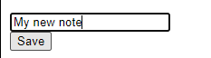

# New Note Diagram

1. Client enters in the input field what they wish for their note to be and clicks save 
2. This sends a POST request to https://studies.cs.helsinki.fi/exampleapp/new_note
3. Then the browser sends a GET request for https://studies.cs.helsinki.fi/exampleapp/notes which is returned from the server
4. Client browser then requests for main.css, main.js and data.json which are also returned from the server
5. Finally rendering all the notes with the clients newly added one at the bottom. 